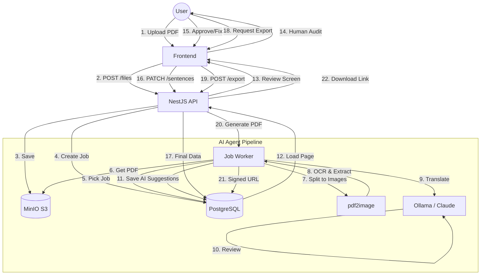

# tAI — Product Overview

## What It Is

tAI (Translation AI) is a multi-agent document translation platform. It uses AI to translate source documents into a target language following domain-specific style and terminology rules, then routes the output through a structured human review workflow to produce publication-quality translations.

tAI works for any language pair and any domain — literary, theological, legal, medical, technical, or otherwise. The style rules, terminology, and tone for each domain are defined in a **Genre** document that is injected into every AI prompt.

## Problem

AI models can produce grammatically plausible translations but make consistent mistakes on domain-specific terminology, register, and style. Human reviewers exist but need tooling to efficiently review, annotate, and approve AI output at scale. tAI accelerates this workflow without replacing human judgment.

## Core Workflow

Every document moves through a strictly gated pipeline. AI acts as a high-speed draft generator and quality auditor, while humans provide final approval.

### Data Flow Diagram

Every page goes through human review. AI is an accelerator, not a replacement.

---

## User Roles

| Role | What They Do |
|------|-------------|
| **REVIEWER** | Reviews assigned pages: approves, requests changes, escalates errors. Can use the chat assistant in review context. |
| **MASTER** | All Reviewer capabilities + can override any page status, resolve escalations, manage genres, bulk-reassign pages. |
| **ADMIN** | All Master capabilities + manages users (invite, deactivate, reset password), configures AI models, views system settings. |

All roles access the same UI; capabilities are gated by role guards.

---

## Core Concepts

### Genre
A translation ruleset for a document category (e.g., "Literary Fiction EN→TA", "Medical Reports EN→DE"). Defined as a rich markdown document describing the required style, terminology, tone, and examples. Has version history. The active version is injected into every AI prompt for that genre's projects.

### Project
One document (PDF). Linked to a genre. Contains chapters → pages → sentences. Tracks progress from extraction through approval.

### Sentence
The atomic unit of translation. Each sentence has an original source text, a translation, and an optional list of AI-detected suggestions.

### Suggestion / Error
An AI-detected issue on a sentence with a suggested correction and explanation. Displayed as an inline popover in the editor.

### Job
A background task (PDF extraction, page translation, AI review, export). Tracked in DB with status and progress. Frontend polls for updates.

### Chat Assistant
A context-aware AI assistant embedded in the genre editor and review screen. Supports two modes:
- **Plan mode** — read-only advice (suggests edits, explains decisions)
- **Build mode** — writes changes directly (updates genre content, applies error fixes)

---

## Non-Goals (v1)

- Mobile support (tablet minimum: 1024px)
- Real-time collaboration (multiple reviewers on the same page simultaneously)
- LoRA fine-tuning
- Webhooks or external integrations
- Cmd+K global search palette
- User profile screen

---

## Language Configuration

Source and target languages are configured per project. Both language fields in the New Project modal are functional selectors. The AI agents receive the project's `sourceLang` and `targetLang` and the genre's style guide — this is what drives translation quality for any language pair.

The quality of AI output depends on the configured LLM model's support for the chosen language pair. Ollama and Anthropic models support many major languages; exotic or low-resource language pairs may require additional genre-level guidance.

---

## Key Constraints

- Tablet-first (min 1024px; desktop 1400px+ is the primary target)
- Dark and light theme both required
- All LLM calls are async (polling, not streaming — except chat assistant which uses SSE)
- Every human action is logged to `ActivityLog`
- API keys stored encrypted at rest
- JWT access token (15m) + refresh token (7d, rotatable, stored in DB)
