# tAI — Sequence Diagrams

All diagrams use Mermaid syntax. Participants: **FE** (Frontend), **API** (NestJS), **DB** (PostgreSQL), **MinIO**, **Ollama/Claude** (LLM), **Mail** (maildev).

---

## 1. Auth — Login

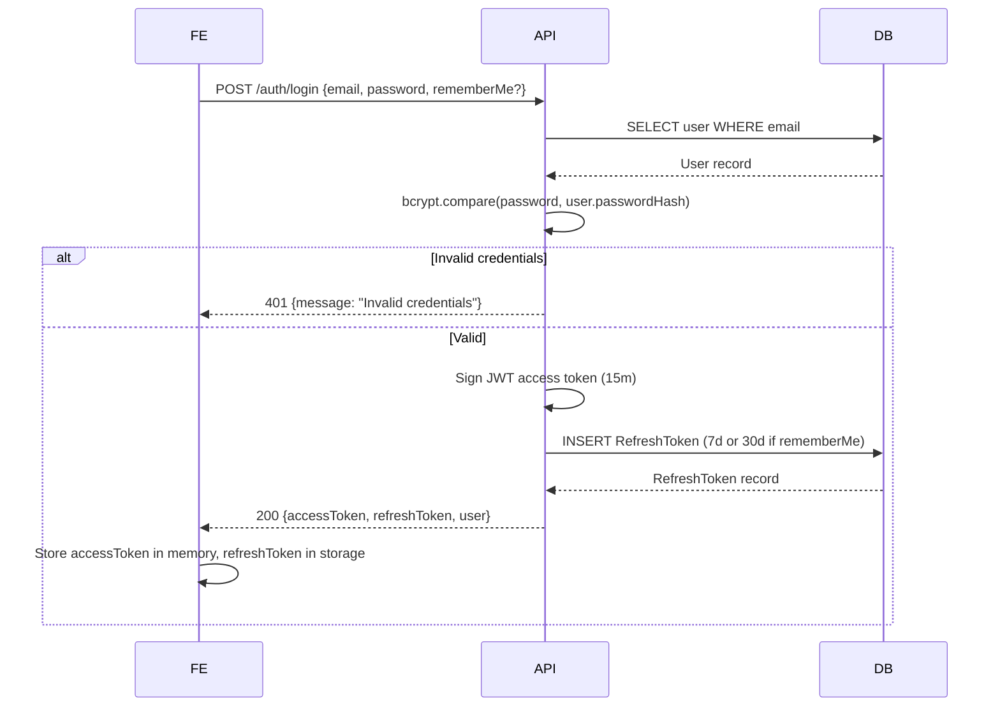
```mermaid
sequenceDiagram
    participant FE
    participant API
    participant DB

    FE->>API: POST /auth/login {email, password, rememberMe?}
    API->>DB: SELECT user WHERE email
    DB-->>API: User record
    API->>API: bcrypt.compare(password, user.passwordHash)
    alt Invalid credentials
        API-->>FE: 401 {message: "Invalid credentials"}
    else Valid
        API->>API: Sign JWT access token (15m)
        API->>DB: INSERT RefreshToken (7d or 30d if rememberMe)
        DB-->>API: RefreshToken record
        API-->>FE: 200 {accessToken, refreshToken, user}
        FE->>FE: Store accessToken in memory, refreshToken in storage
    end
```

---

## 2. Auth — Token Refresh

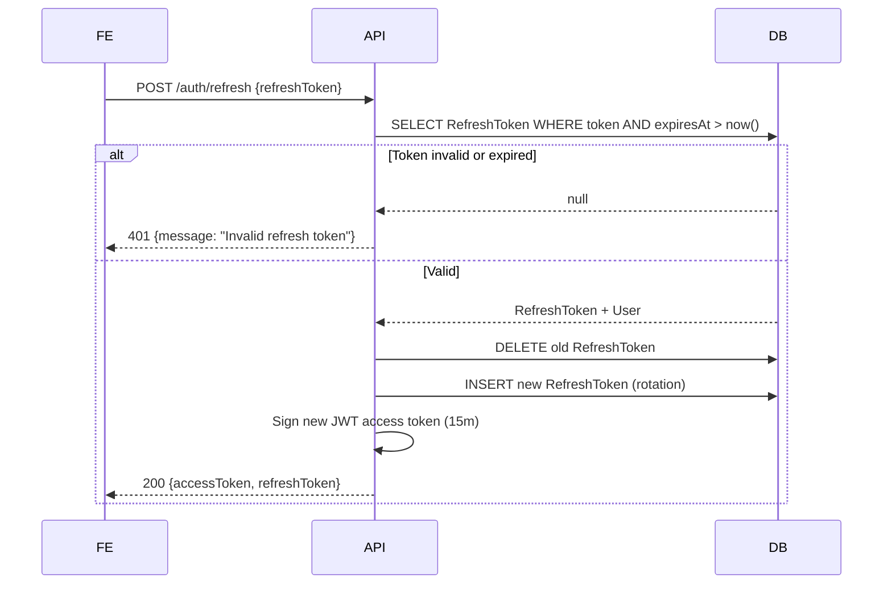
```mermaid
sequenceDiagram
    participant FE
    participant API
    participant DB

    FE->>API: POST /auth/refresh {refreshToken}
    API->>DB: SELECT RefreshToken WHERE token AND expiresAt > now()
    alt Token invalid or expired
        DB-->>API: null
        API-->>FE: 401 {message: "Invalid refresh token"}
    else Valid
        DB-->>API: RefreshToken + User
        API->>DB: DELETE old RefreshToken
        API->>DB: INSERT new RefreshToken (rotation)
        API->>API: Sign new JWT access token (15m)
        API-->>FE: 200 {accessToken, refreshToken}
    end
```

---

## 3. Auth — Forgot / Reset Password

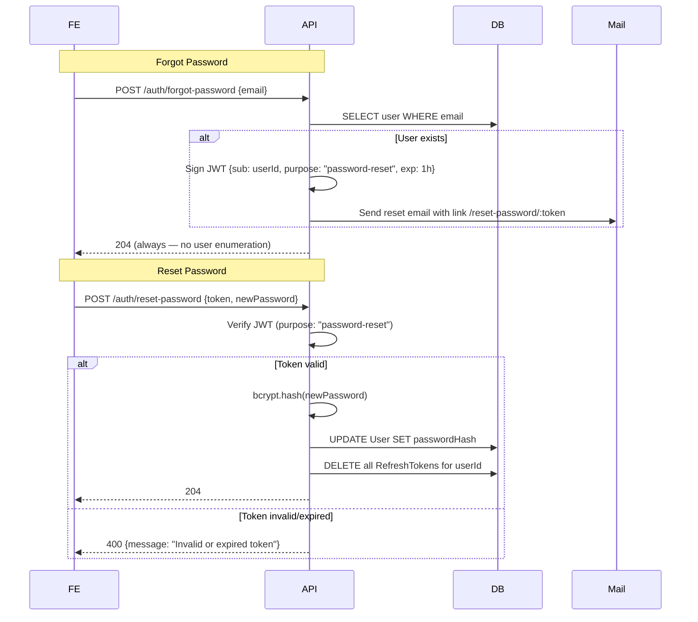
```mermaid
sequenceDiagram
    participant FE
    participant API
    participant DB
    participant Mail

    Note over FE,API: Forgot Password
    FE->>API: POST /auth/forgot-password {email}
    API->>DB: SELECT user WHERE email
    alt User exists
        API->>API: Sign JWT {sub: userId, purpose: "password-reset", exp: 1h}
        API->>Mail: Send reset email with link /reset-password/:token
    end
    API-->>FE: 204 (always — no user enumeration)

    Note over FE,API: Reset Password
    FE->>API: POST /auth/reset-password {token, newPassword}
    API->>API: Verify JWT (purpose: "password-reset")
    alt Token valid
        API->>API: bcrypt.hash(newPassword)
        API->>DB: UPDATE User SET passwordHash
        API->>DB: DELETE all RefreshTokens for userId
        API-->>FE: 204
    else Token invalid/expired
        API-->>FE: 400 {message: "Invalid or expired token"}
    end
```

---

## 4. Project Creation + Auto-Pipeline

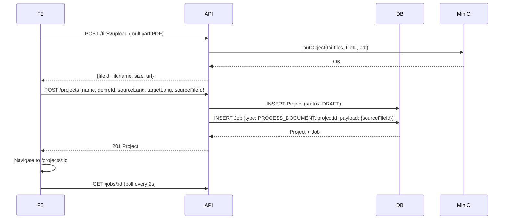
```mermaid
sequenceDiagram
    participant FE
    participant API
    participant DB
    participant MinIO

    FE->>API: POST /files/upload (multipart PDF)
    API->>MinIO: putObject(tai-files, fileId, pdf)
    MinIO-->>API: OK
    API-->>FE: {fileId, filename, size, url}

    FE->>API: POST /projects {name, genreId, sourceLang, targetLang, sourceFileId}
    API->>DB: INSERT Project (status: DRAFT)
    API->>DB: INSERT Job (type: PROCESS_DOCUMENT, projectId, payload: {sourceFileId})
    DB-->>API: Project + Job
    API-->>FE: 201 Project

    FE->>FE: Navigate to /projects/:id
    FE->>API: GET /jobs/:id (poll every 2s)
```

---

## 5. PDF Extraction Pipeline (Batch & Queue)

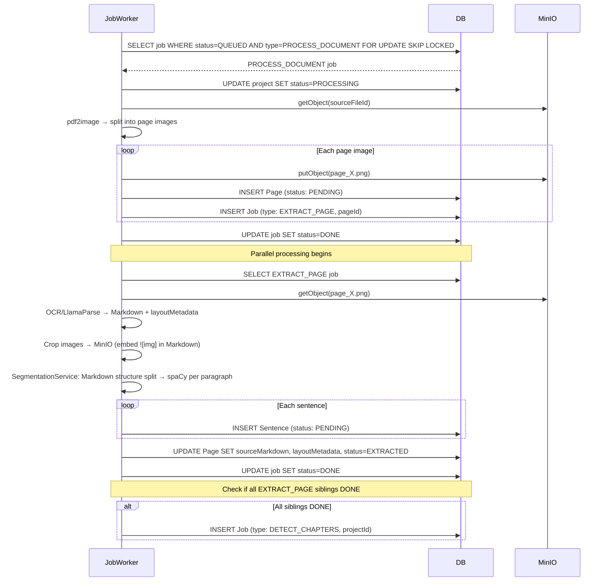
```mermaid
sequenceDiagram
    participant Worker as JobWorker
    participant DB
    participant MinIO

    Worker->>DB: SELECT job WHERE status=QUEUED AND type=PROCESS_DOCUMENT FOR UPDATE SKIP LOCKED
    DB-->>Worker: PROCESS_DOCUMENT job
    Worker->>DB: UPDATE project SET status=PROCESSING

    Worker->>MinIO: getObject(sourceFileId)
    Worker->>Worker: pdf2image → split into page images
    
    loop Each page image
        Worker->>MinIO: putObject(page_X.png)
        Worker->>DB: INSERT Page (status: PENDING)
        Worker->>DB: INSERT Job (type: EXTRACT_PAGE, pageId)
    end
    Worker->>DB: UPDATE job SET status=DONE

    Note over Worker,DB: Parallel processing begins

    Worker->>DB: SELECT EXTRACT_PAGE job
    Worker->>MinIO: getObject(page_X.png)
    Worker->>Worker: OCR/LlamaParse → Markdown + layoutMetadata
    Worker->>Worker: Crop images → MinIO (embed ![img] in Markdown)
    Worker->>Worker: SegmentationService: Markdown structure split → spaCy per paragraph
    
    loop Each sentence
        Worker->>DB: INSERT Sentence (status: PENDING)
    end
    Worker->>DB: UPDATE Page SET sourceMarkdown, layoutMetadata, status=EXTRACTED

    Worker->>DB: UPDATE job SET status=DONE
    Note over Worker,DB: Check if all EXTRACT_PAGE siblings DONE
    alt All siblings DONE
        Worker->>DB: INSERT Job (type: DETECT_CHAPTERS, projectId)
    end
```

---

## 5b. DETECT_CHAPTERS + Batch Planning

```mermaid
sequenceDiagram
    participant Worker as JobWorker
    participant DB

    Worker->>DB: SELECT DETECT_CHAPTERS job FOR UPDATE SKIP LOCKED
    Worker->>DB: SELECT all Pages for project ORDER BY pageNumber
    Worker->>Worker: Cross-page sentence stitching (detect + merge fragments)
    loop Each merged/deleted sentence
        Worker->>DB: UPDATE/DELETE Sentence; UPDATE Page.sourceMarkdown
    end
    Worker->>Worker: detectChapters() across all sourceMarkdown → Chapter spans
    loop Each Chapter
        Worker->>DB: INSERT Chapter; UPDATE pages SET chapterId
    end
    Worker->>Worker: Token-budget batch planner → group pages into batches
    loop Each batch
        Worker->>DB: INSERT Job (type: TRANSLATE_BATCH, payload: {projectId, pageIds: [...]})
    end
    Worker->>DB: UPDATE job SET status=DONE
```

---

## 6. Translation Pipeline (TRANSLATE_BATCH Job)

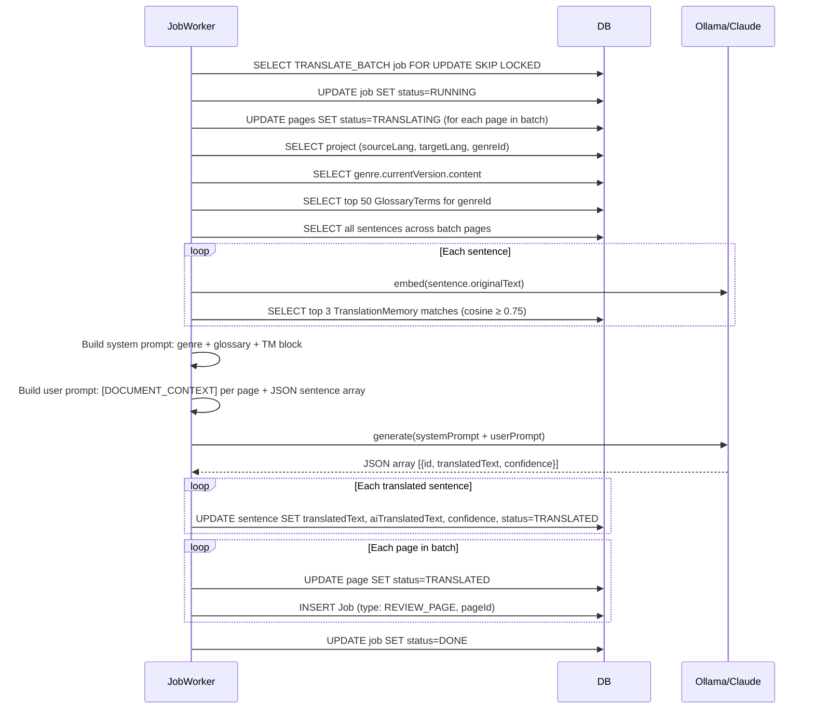
```mermaid
sequenceDiagram
    participant Worker as JobWorker
    participant DB
    participant LLM as Ollama/Claude

    Worker->>DB: SELECT TRANSLATE_BATCH job FOR UPDATE SKIP LOCKED
    Worker->>DB: UPDATE job SET status=RUNNING
    Worker->>DB: UPDATE pages SET status=TRANSLATING (for each page in batch)
    Worker->>DB: SELECT project (sourceLang, targetLang, genreId)
    Worker->>DB: SELECT genre.currentVersion.content
    Worker->>DB: SELECT top 50 GlossaryTerms for genreId
    Worker->>DB: SELECT all sentences across batch pages

    loop Each sentence
        Worker->>LLM: embed(sentence.originalText)
        Worker->>DB: SELECT top 3 TranslationMemory matches (cosine ≥ 0.75)
    end

    Worker->>Worker: Build system prompt: genre + glossary + TM block
    Worker->>Worker: Build user prompt: [DOCUMENT_CONTEXT] per page + JSON sentence array
    Worker->>LLM: generate(systemPrompt + userPrompt)
    LLM-->>Worker: JSON array [{id, translatedText, confidence}]

    loop Each translated sentence
        Worker->>DB: UPDATE sentence SET translatedText, aiTranslatedText, confidence, status=TRANSLATED
    end

    loop Each page in batch
        Worker->>DB: UPDATE page SET status=TRANSLATED
        Worker->>DB: INSERT Job (type: REVIEW_PAGE, pageId)
    end
    Worker->>DB: UPDATE job SET status=DONE
```

---

## 7. Review Pipeline (REVIEW_PAGE Job)

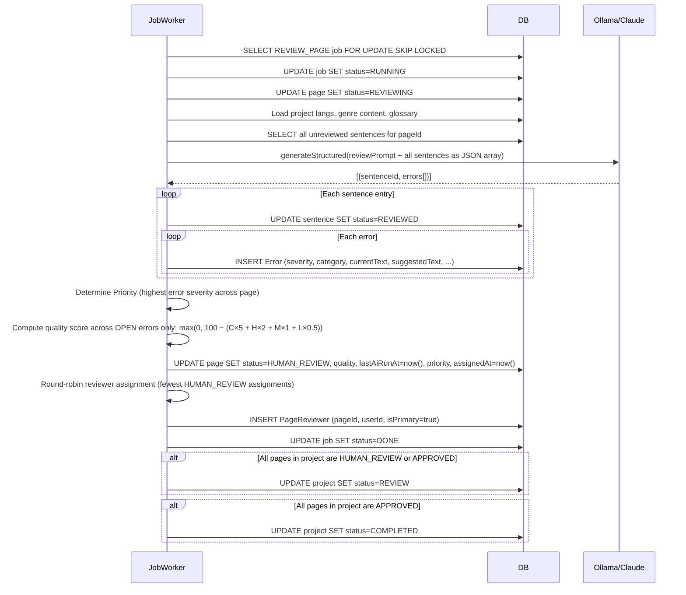
```mermaid
sequenceDiagram
    participant Worker as JobWorker
    participant DB
    participant LLM as Ollama/Claude

    Worker->>DB: SELECT REVIEW_PAGE job FOR UPDATE SKIP LOCKED
    Worker->>DB: UPDATE job SET status=RUNNING
    Worker->>DB: UPDATE page SET status=REVIEWING
    Worker->>DB: Load project langs, genre content, glossary

    Worker->>DB: SELECT all unreviewed sentences for pageId
    Worker->>LLM: generateStructured(reviewPrompt + all sentences as JSON array)
    LLM-->>Worker: [{sentenceId, errors[]}]

    loop Each sentence entry
        Worker->>DB: UPDATE sentence SET status=REVIEWED
        loop Each error
            Worker->>DB: INSERT Error (severity, category, currentText, suggestedText, ...)
        end
    end

    Worker->>Worker: Determine Priority (highest error severity across page)
    Worker->>Worker: Compute quality score across OPEN errors only: max(0, 100 − (C×5 + H×2 + M×1 + L×0.5))
    Worker->>DB: UPDATE page SET status=HUMAN_REVIEW, quality, lastAiRunAt=now(), priority, assignedAt=now()

    Worker->>Worker: Round-robin reviewer assignment (fewest HUMAN_REVIEW assignments)
    Worker->>DB: INSERT PageReviewer (pageId, userId, isPrimary=true)

    Worker->>DB: UPDATE job SET status=DONE

    alt All pages in project are HUMAN_REVIEW or APPROVED
        Worker->>DB: UPDATE project SET status=REVIEW
    end
    alt All pages in project are APPROVED
        Worker->>DB: UPDATE project SET status=COMPLETED
    end
```

---

## 8. Human Review — Approve Page

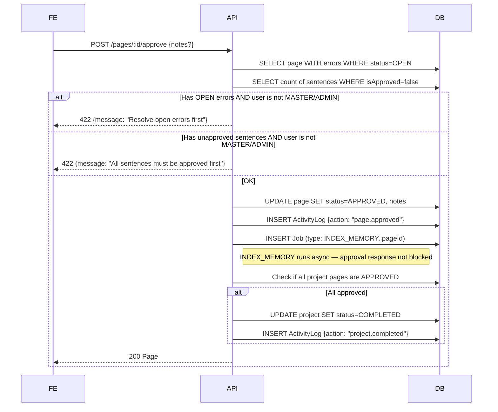
```mermaid
sequenceDiagram
    participant FE
    participant API
    participant DB

    FE->>API: POST /pages/:id/approve {notes?}
    API->>DB: SELECT page WITH errors WHERE status=OPEN
    API->>DB: SELECT count of sentences WHERE isApproved=false
    alt Has OPEN errors AND user is not MASTER/ADMIN
        API-->>FE: 422 {message: "Resolve open errors first"}
    else Has unapproved sentences AND user is not MASTER/ADMIN
        API-->>FE: 422 {message: "All sentences must be approved first"}
    else OK
        API->>DB: UPDATE page SET status=APPROVED, notes
        API->>DB: INSERT ActivityLog {action: "page.approved"}
        API->>DB: INSERT Job (type: INDEX_MEMORY, pageId)
        Note right of API: INDEX_MEMORY runs async — approval response not blocked

        API->>DB: Check if all project pages are APPROVED
        alt All approved
            API->>DB: UPDATE project SET status=COMPLETED
            API->>DB: INSERT ActivityLog {action: "project.completed"}
        end

        API-->>FE: 200 Page
    end
```

---

## 9. Human Review — Request Changes

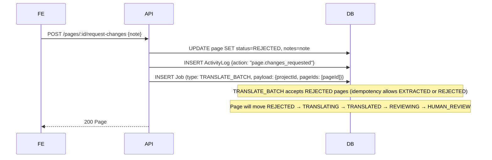
```mermaid
sequenceDiagram
    participant FE
    participant API
    participant DB

    FE->>API: POST /pages/:id/request-changes {note}
    API->>DB: UPDATE page SET status=REJECTED, notes=note
    API->>DB: INSERT ActivityLog {action: "page.changes_requested"}
    API->>DB: INSERT Job (type: TRANSLATE_BATCH, payload: {projectId, pageIds: [pageId]})
    Note over DB: TRANSLATE_BATCH accepts REJECTED pages (idempotency allows EXTRACTED or REJECTED)
    Note over DB: Page will move REJECTED → TRANSLATING → TRANSLATED → REVIEWING → HUMAN_REVIEW
    API-->>FE: 200 Page
```

---

## 10. Human Review — Escalate

```mermaid
sequenceDiagram
    participant FE
    participant API
    participant DB

    FE->>API: POST /pages/:id/escalate {reason}
    API->>DB: UPDATE page SET status=ESCALATED
    API->>DB: INSERT ActivityLog {action: "page.escalated", details: {reason}}
    API-->>FE: 200 Page

    Note over FE: Master reviewer sees escalation in Queue > Needs Attention

    FE->>API: POST /pages/:id/resolve-escalation {resolution}
    API->>DB: UPDATE page SET status=HUMAN_REVIEW
    API->>DB: SELECT PageReviewer WHERE isPrimary=true; assign if active, else round-robin new primary
    API->>DB: INSERT ActivityLog {action: "page.escalation_resolved"}
    API-->>FE: 200 Page
```

---

## 11. Error — Apply Single Fix

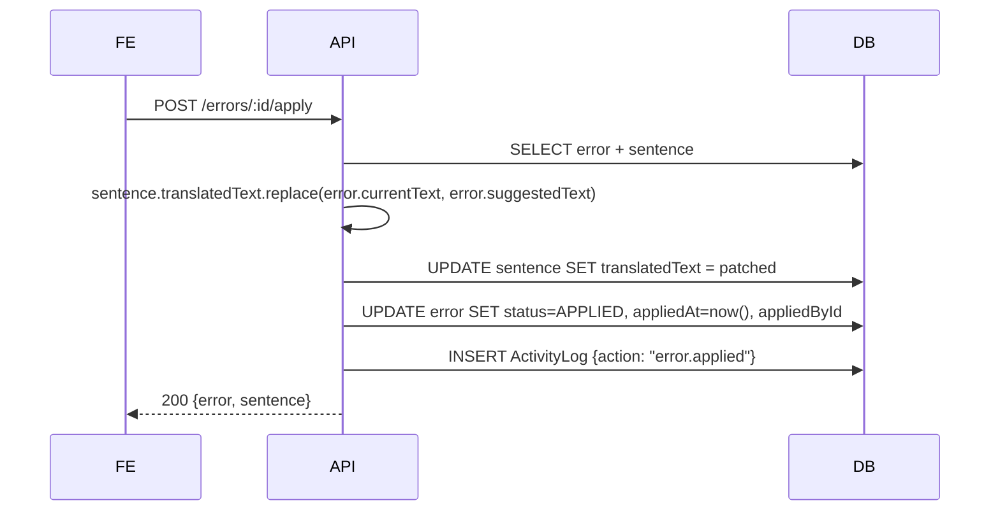
```mermaid
sequenceDiagram
    participant FE
    participant API
    participant DB

    FE->>API: POST /errors/:id/apply
    API->>DB: SELECT error + sentence
    API->>API: sentence.translatedText.replace(error.currentText, error.suggestedText)
    API->>DB: UPDATE sentence SET translatedText = patched
    API->>DB: UPDATE error SET status=APPLIED, appliedAt=now(), appliedById
    API->>DB: INSERT ActivityLog {action: "error.applied"}
    API-->>FE: 200 {error, sentence}
```

---

## 12. Error — Apply All Fixes

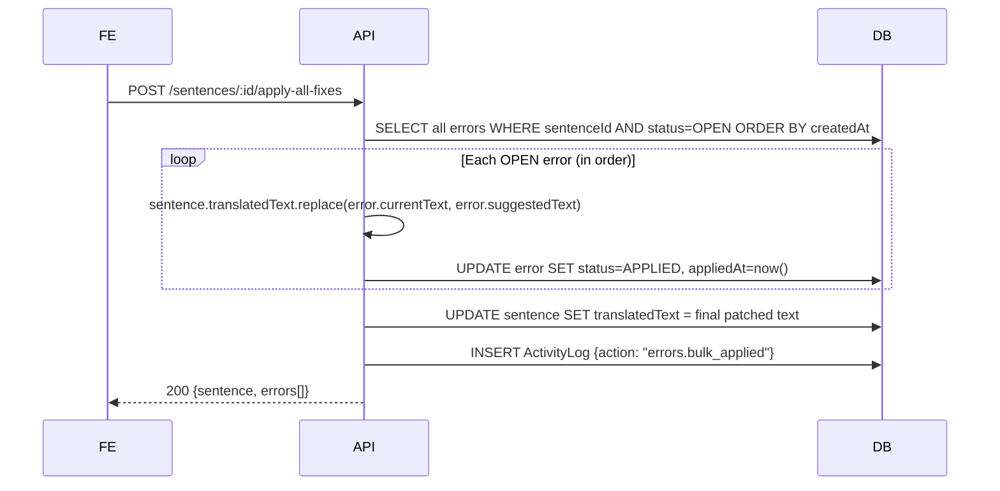
```mermaid
sequenceDiagram
    participant FE
    participant API
    participant DB

    FE->>API: POST /sentences/:id/apply-all-fixes
    API->>DB: SELECT all errors WHERE sentenceId AND status=OPEN ORDER BY createdAt
    loop Each OPEN error (in order)
        API->>API: sentence.translatedText.replace(error.currentText, error.suggestedText)
        API->>DB: UPDATE error SET status=APPLIED, appliedAt=now()
    end
    API->>DB: UPDATE sentence SET translatedText = final patched text
    API->>DB: INSERT ActivityLog {action: "errors.bulk_applied"}
    API-->>FE: 200 {sentence, errors[]}
```

---

## 13. Error — Add to Exceptions

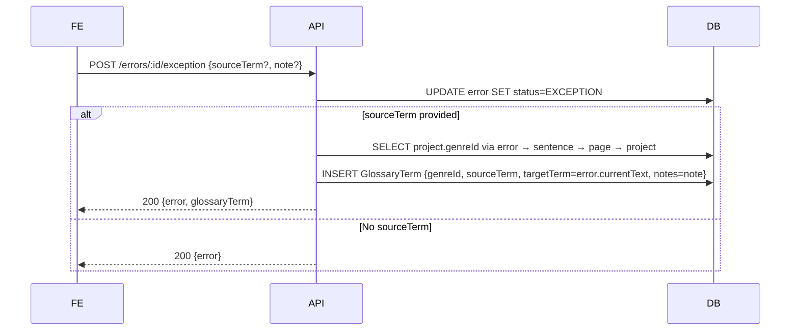
```mermaid
sequenceDiagram
    participant FE
    participant API
    participant DB

    FE->>API: POST /errors/:id/exception {sourceTerm?, note?}
    API->>DB: UPDATE error SET status=EXCEPTION

    alt sourceTerm provided
        API->>DB: SELECT project.genreId via error → sentence → page → project
        API->>DB: INSERT GlossaryTerm {genreId, sourceTerm, targetTerm=error.currentText, notes=note}
        API-->>FE: 200 {error, glossaryTerm}
    else No sourceTerm
        API-->>FE: 200 {error}
    end
```

---

## 14. Genre — Create Version + Chat (Plan Mode)

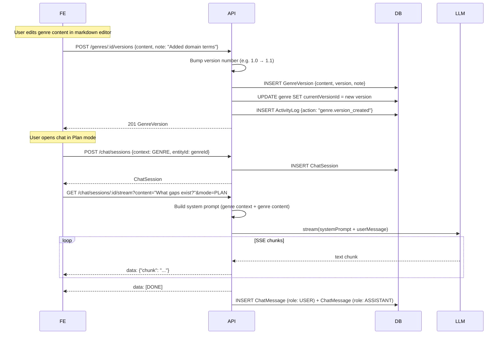
```mermaid
sequenceDiagram
    participant FE
    participant API
    participant DB
    participant LLM

    Note over FE: User edits genre content in markdown editor

    FE->>API: POST /genres/:id/versions {content, note: "Added domain terms"}
    API->>API: Bump version number (e.g. 1.0 → 1.1)
    API->>DB: INSERT GenreVersion {content, version, note}
    API->>DB: UPDATE genre SET currentVersionId = new version
    API->>DB: INSERT ActivityLog {action: "genre.version_created"}
    API-->>FE: 201 GenreVersion

    Note over FE: User opens chat in Plan mode

    FE->>API: POST /chat/sessions {context: GENRE, entityId: genreId}
    API->>DB: INSERT ChatSession
    API-->>FE: ChatSession

    FE->>API: GET /chat/sessions/:id/stream?content="What gaps exist?"&mode=PLAN
    API->>API: Build system prompt (genre context + genre content)
    API->>LLM: stream(systemPrompt + userMessage)
    loop SSE chunks
        LLM-->>API: text chunk
        API-->>FE: data: {"chunk": "..."}
    end
    API-->>FE: data: [DONE]
    API->>DB: INSERT ChatMessage (role: USER) + ChatMessage (role: ASSISTANT)
```

---

## 15. Genre — Chat (Build Mode)

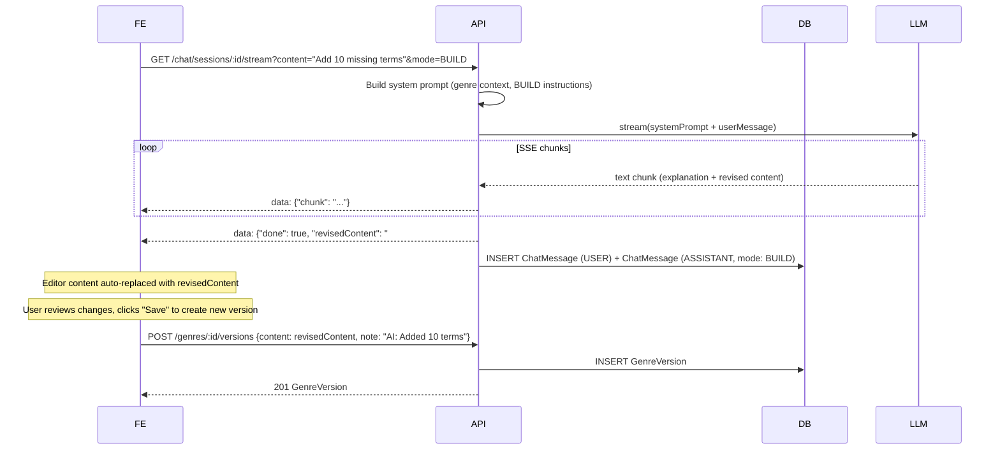
```mermaid
sequenceDiagram
    participant FE
    participant API
    participant DB
    participant LLM

    FE->>API: GET /chat/sessions/:id/stream?content="Add 10 missing terms"&mode=BUILD
    API->>API: Build system prompt (genre context, BUILD instructions)
    API->>LLM: stream(systemPrompt + userMessage)
    loop SSE chunks
        LLM-->>API: text chunk (explanation + revised content)
        API-->>FE: data: {"chunk": "..."}
    end
    API-->>FE: data: {"done": true, "revisedContent": "# Translation Guidelines\n..."}
    API->>DB: INSERT ChatMessage (USER) + ChatMessage (ASSISTANT, mode: BUILD)

    Note over FE: Editor content auto-replaced with revisedContent
    Note over FE: User reviews changes, clicks "Save" to create new version

    FE->>API: POST /genres/:id/versions {content: revisedContent, note: "AI: Added 10 terms"}
    API->>DB: INSERT GenreVersion
    API-->>FE: 201 GenreVersion
```

---

## 16. Genre — Test Translation

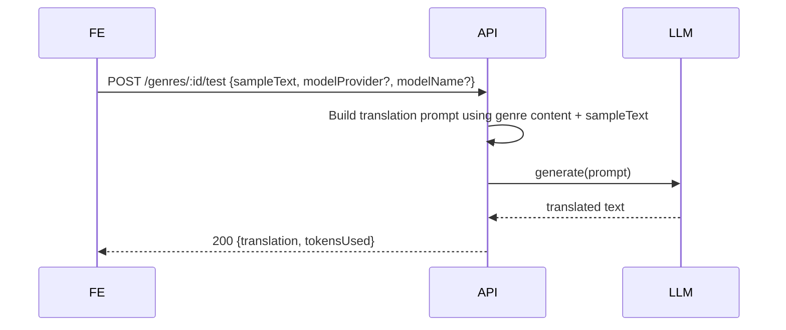
```mermaid
sequenceDiagram
    participant FE
    participant API
    participant LLM

    FE->>API: POST /genres/:id/test {sampleText, modelProvider?, modelName?}
    API->>API: Build translation prompt using genre content + sampleText
    API->>LLM: generate(prompt)
    LLM-->>API: translated text
    API-->>FE: 200 {translation, tokensUsed}
```

---

## 17. Genre — Version Restore

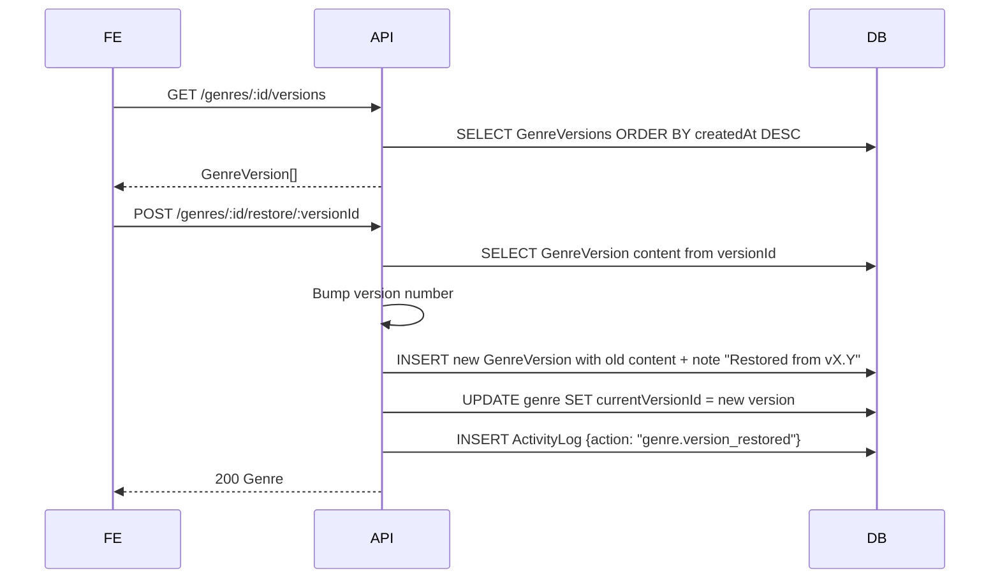
```mermaid
sequenceDiagram
    participant FE
    participant API
    participant DB

    FE->>API: GET /genres/:id/versions
    API->>DB: SELECT GenreVersions ORDER BY createdAt DESC
    API-->>FE: GenreVersion[]

    FE->>API: POST /genres/:id/restore/:versionId
    API->>DB: SELECT GenreVersion content from versionId
    API->>API: Bump version number
    API->>DB: INSERT new GenreVersion with old content + note "Restored from vX.Y"
    API->>DB: UPDATE genre SET currentVersionId = new version
    API->>DB: INSERT ActivityLog {action: "genre.version_restored"}
    API-->>FE: 200 Genre
```

---

## 18. Glossary — Bulk Import

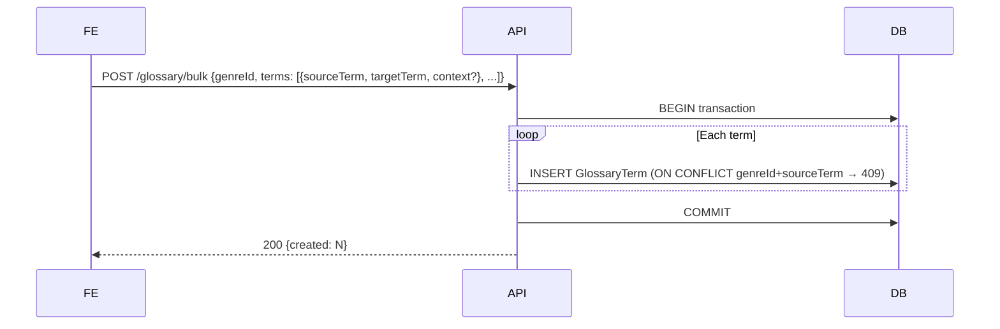
```mermaid
sequenceDiagram
    participant FE
    participant API
    participant DB

    FE->>API: POST /glossary/bulk {genreId, terms: [{sourceTerm, targetTerm, context?}, ...]}
    API->>DB: BEGIN transaction
    loop Each term
        API->>DB: INSERT GlossaryTerm (ON CONFLICT genreId+sourceTerm → 409)
    end
    API->>DB: COMMIT
    API-->>FE: 200 {created: N}
```

---

## 19. Glossary — Lookup (from Review Screen)

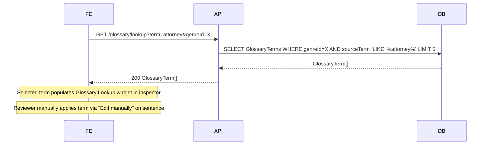
```mermaid
sequenceDiagram
    participant FE
    participant API
    participant DB

    FE->>API: GET /glossary/lookup?term=attorney&genreId=X
    API->>DB: SELECT GlossaryTerms WHERE genreId=X AND sourceTerm ILIKE '%attorney%' LIMIT 5
    DB-->>API: GlossaryTerm[]
    API-->>FE: 200 GlossaryTerm[]

    Note over FE: Selected term populates Glossary Lookup widget in inspector
    Note over FE: Reviewer manually applies term via "Edit manually" on sentence
```

---

## 20. Export — Project PDF

```mermaid
sequenceDiagram
    participant FE
    participant API
    participant DB
    participant Worker as JobWorker
    participant MinIO

    FE->>API: POST /export/project/:id {format: "pdf", scope: "approved"}
    API->>DB: INSERT Job (type: EXPORT_PROJECT, projectId, payload: {format, scope})
    API-->>FE: 200 {jobId}

    FE->>API: GET /jobs/:id (poll every 2s)

    Worker->>DB: SELECT EXPORT_PROJECT job FOR UPDATE SKIP LOCKED
    Worker->>DB: UPDATE job SET status=RUNNING
    Worker->>DB: SELECT pages + sentences WHERE status=APPROVED
    Worker->>Worker: pdfkit → generate PDF (embed Unicode font)
    Worker->>MinIO: putObject(export-fileId, pdf)
    Worker->>DB: UPDATE job SET status=DONE, result={fileUrl: signedUrl}

    FE->>API: GET /jobs/:id
    API-->>FE: {status: DONE, result: {fileUrl}}
    FE->>FE: Download from fileUrl
```

---

## 21. Export — Page Report

```mermaid
sequenceDiagram
    participant FE
    participant API
    participant DB
    participant Worker as JobWorker
    participant MinIO

    FE->>API: POST /export/page/:id/report
    API->>DB: INSERT Job (type: EXPORT_PAGE_REPORT, pageId)
    API-->>FE: 200 {jobId}

    Worker->>DB: Pick up job
    Worker->>DB: SELECT page + sentences + errors
    Worker->>Worker: Generate sentence-by-sentence report (pdfkit)
    Worker->>MinIO: putObject(report-fileId, pdf)
    Worker->>DB: UPDATE job SET status=DONE, result={fileUrl}

    FE->>API: GET /jobs/:id → {status: DONE, result: {fileUrl}}
    FE->>FE: Download report
```

---

## 22. Admin — Bulk Reassign

```mermaid
sequenceDiagram
    participant FE
    participant API
    participant DB

    FE->>API: POST /admin/bulk-reassign {pageIds: [...], reviewerId}
    loop Each pageId
        API->>DB: DELETE PageReviewer WHERE pageId
        API->>DB: INSERT PageReviewer (pageId, userId=reviewerId, isPrimary=true)
        API->>DB: UPDATE page SET assignedAt=now()
        API->>DB: INSERT ActivityLog {action: "page.reassigned"}
    end
    API-->>FE: 200 {updated: N}
```

---

## 23. Admin — Bulk Approve

```mermaid
sequenceDiagram
    participant FE
    participant API
    participant DB

    FE->>API: POST /admin/bulk-approve {pageIds: [...]}
    loop Each pageId
        API->>DB: SELECT page + OPEN error count
        alt Has OPEN errors
            Note over API: Skip this page
        else No OPEN errors
            API->>DB: UPDATE page SET status=APPROVED
            API->>DB: INSERT ActivityLog {action: "page.approved"}
        end
    end
    API->>DB: Check if any project is now fully approved → UPDATE status=COMPLETED
    API-->>FE: 200 {updated: N, skipped: M}
```

---

## 24. Admin — Override Page Status

```mermaid
sequenceDiagram
    participant FE
    participant API
    participant DB

    FE->>API: POST /admin/pages/:id/override {status, reason}
    API->>DB: UPDATE page SET status (bypasses OPEN error check)
    API->>DB: INSERT ActivityLog {action: "page.overridden", details: {oldStatus, newStatus, reason}}
    API-->>FE: 200 Page
```

---

## 25. User Invite

```mermaid
sequenceDiagram
    participant FE
    participant API
    participant DB
    participant Mail

    FE->>API: POST /users/invite {name, email, role}
    API->>API: Generate temporary password
    API->>API: bcrypt.hash(tempPassword)
    API->>DB: INSERT User {name, email, passwordHash, role}
    API->>Mail: Send invite email with tempPassword + login link
    API->>DB: INSERT ActivityLog {action: "user.invited"}
    API-->>FE: 201 User
```

---

## 26. Dashboard Load

```mermaid
sequenceDiagram
    participant FE
    participant API
    participant DB

    FE->>API: GET /dashboard/stats
    FE->>API: GET /dashboard/throughput?metric=pages&weeks=12
    FE->>API: GET /dashboard/my-queue?limit=5
    FE->>API: GET /dashboard/recent-projects?limit=4
    FE->>API: GET /dashboard/activity?limit=10

    Note over API: All endpoints check 30s in-memory cache first

    API->>DB: Aggregate queries (counts, avgs, deltas)
    API-->>FE: DashboardStats + WeeklyBar[] + PageListItem[] + ProjectListItem[] + ActivityLog[]
```

---

## 27. Review Screen — Full Workflow

```mermaid
sequenceDiagram
    participant FE
    participant API
    participant DB

    FE->>API: GET /pages/:id (with sentences + errors)
    API-->>FE: PageDetail

    Note over FE: Reviewer clicks through sentences

    FE->>API: PATCH /sentences/:id {isApproved: true}
    API->>DB: UPDATE sentence SET isApproved=true, reviewedAt=now(), reviewedById
    API-->>FE: Sentence

    Note over FE: Reviewer applies a single error fix
    FE->>API: POST /errors/:id/apply
    API->>DB: Patch sentence text + set error APPLIED
    API-->>FE: {error, sentence}

    Note over FE: Reviewer approves page

    FE->>API: POST /pages/:id/approve {notes: "Looks good"}
    API-->>FE: Page (status: APPROVED)

    FE->>API: GET /pages/:id/next-in-queue
    alt More pages
        API-->>FE: {pageId: "next-page-id"}
        FE->>FE: Navigate to /review/:nextPageId
    else Queue empty
        API-->>FE: null
        FE->>FE: Navigate to /queue with "Queue complete" toast
    end
```

---

## 28. Job Polling (Frontend)

```mermaid
sequenceDiagram
    participant FE
    participant API
    participant DB

    Note over FE: After creating a job (translate, review, export)

    loop Every 2 seconds while status ∈ {QUEUED, RUNNING}
        FE->>API: GET /jobs/:id
        API->>DB: SELECT job
        API-->>FE: {status, progress, result?, errorMessage?}

        alt status = RUNNING
            FE->>FE: Update progress bar (progress %)
        else status = DONE
            FE->>FE: Show success toast, refresh data
        else status = FAILED
            FE->>FE: Show error banner with errorMessage + "Retry" button
        end
    end
```

---

## 29. Job Retry (on Error)

```mermaid
sequenceDiagram
    participant FE
    participant API
    participant DB

    Note over FE: Page shows ERROR status with error banner

    FE->>API: POST /jobs {type: TRANSLATE_BATCH, payload: {projectId, pageIds: [pageId]}}
    API->>DB: UPDATE page SET status=EXTRACTED, retryCount += 1
    API->>DB: INSERT Job (type: TRANSLATE_BATCH, payload: {projectId, pageIds: [pageId]})
    API-->>FE: Job

    Note over FE: Resumes polling; page re-enters pipeline
```

---

## 30. Model Configuration

```mermaid
sequenceDiagram
    participant FE
    participant API
    participant DB
    participant LLM

    FE->>API: POST /models/test {provider: "OLLAMA", modelName: "qwen2.5:7b", endpoint}
    API->>LLM: Simple test prompt ("Hello")
    alt Online
        LLM-->>API: Response
        API-->>FE: {online: true, latencyMs: 230}
    else Offline
        API-->>FE: {online: false, error: "Connection refused"}
    end

    FE->>API: PUT /models/TRANSLATION {provider: "OLLAMA", modelName: "qwen2.5:7b", endpoint}
    API->>API: Encrypt apiKey with AES-256-GCM (if provided)
    API->>DB: UPSERT ModelConfig for agentType=TRANSLATION
    API-->>FE: ModelConfig
```

---

## 31. Translation Memory Indexing (RAG)

```mermaid
sequenceDiagram
    participant Worker as JobWorker
    participant DB
    participant LLM

    Note over Worker,DB: INDEX_MEMORY job — picked up by JobWorker after page approval

    Worker->>DB: SELECT QUEUED INDEX_MEMORY job FOR UPDATE SKIP LOCKED
    Worker->>DB: SELECT all sentences for pageId
    loop Each sentence
        Worker->>LLM: embed(sentence.originalText) → 768-dim vector
        Worker->>DB: UPSERT TranslationMemory {genreId, sourceLang, targetLang, originalText, translatedText, embedding}
    end
    Worker->>DB: UPDATE job SET status=DONE
```
